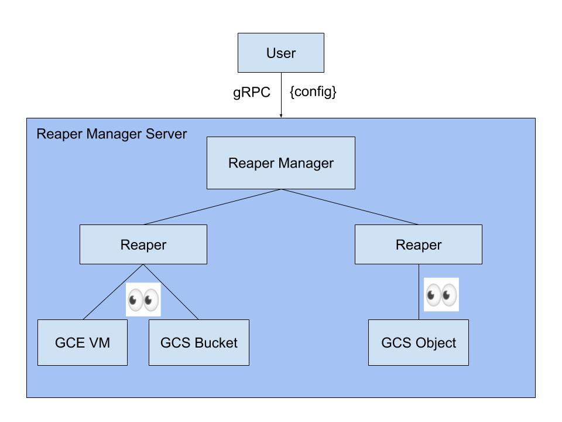

# GCP Resource Reaper

The GCP Resource Reaper is a system to register and clean up leaked
GCP resources. It is configured dynamically via protocol buffers, and
runs on a given schedule until it is stopped by the user.


NOTE: This is not an officially supported Google product

## Usage

Ideal use case for applications that created many GCP resources
during end-to-end test. The reaper can act as a failsafe, so if
resources are failed to be deleted as a result of test cancelation,
test failure or a coding error, the engineer doesn't have to spend 
hours debugging.

<details><summary><b>Show Instructions</b></summary>

1. Download required tools
   * [Go](https://golang.org/dl/)
   * [Bazel](https://docs.bazel.build/versions/master/install.html)
2. Clone the repository and cd into it
   ```sh
   $ git clone https://github.com/googleinterns/cloudai-gcp-test-resource-reaper
   $ cd cloudai-gcp-test-resource-reaper
   ```
3. Start the gRPC server
   ```sh
    $ bazel run //cmd/start_server:start_server -- -logs-project=YOUR_GCP_PROJECT -logs-name=YOUR_LOGS_NAME
   ```
   **Note**: You can view logs in either the logs.txt file that was created, or in stackdriver cloud logs based off of the information you passed here.
4. Start the reaper manager
   ```sh
   $ bazel run //cmd/reaper:reaper -- start
   ```
5. Create a new reaper
   ```sh
   $ bazel run //cmd/reaper:reaper -- create
   ```
6. Follow the prompt to create a new reaper based off of which resource you want to monitor
7. Once the reaper is created, you can run any of the following:
   * View all running reapers:
    ```sh
    $ bazel run //cmd/reaper:reaper -- list
    ```
   * View report of reaper manager of currently monitored resources and previously deleted resources
    ```sh
    $ bazel run //cmd/reaper:reaper -- report
    ```
8. Delete the reaper once you are ready
   ```sh
   $ bazel run //cmd/reaper:reaper -- delete -uuid=REAPER_UUID
   ```
9. Shutdown the reaper manager
    ```sh
    $ bazel run //cmd/reaper:reaper -- shutdown
    ```

</details>

## How It Works



The user configures the reaper manager over gRPC. The reaper manager
holds multiple reapers, each of which monitors the resources defined
in the ReaperConfig. The reaper will delete the WatchedResource once
it's past its Time-To-Live (TTL).

## Config Protos

There are two protos for configuring the reaper: **ReaperConfig** and **ResourceConfig**.
* **ReaperConfig**: Defines properties of the reaper, and which resources will be monitored.
    ```protobuf
    message ReaperConfig {
        repeated ResourceConfig resources = 1;
        string schedule = 2;
        string project_id = 3;
        string uuid = 4;
    }
    ```
* **ResourceConfig**: Describes a set of resources and their TTL.
    ```protobuf
    message ResourceConfig {
        ResourceType resource_type = 1;
        string name_filter = 2;
        string skip_filter = 3;
        repeated string zones = 4;
        string ttl = 5;
    }
    ```

## Source Code Headers

Every file containing source code must include copyright and license
information. This includes any JS/CSS files that you might be serving out to
browsers. (This is to help well-intentioned people avoid accidental copying that
doesn't comply with the license.)

Apache header:

    Copyright 2020 Google LLC

    Licensed under the Apache License, Version 2.0 (the "License");
    you may not use this file except in compliance with the License.
    You may obtain a copy of the License at

        https://www.apache.org/licenses/LICENSE-2.0

    Unless required by applicable law or agreed to in writing, software
    distributed under the License is distributed on an "AS IS" BASIS,
    WITHOUT WARRANTIES OR CONDITIONS OF ANY KIND, either express or implied.
    See the License for the specific language governing permissions and
    limitations under the License.
